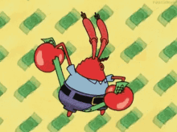

```{r, child="00-preamble.Rmd"}

```

class: middle, center

# Sobre a Curso-R

---

class: middle, center

## A empresa

.pull-left[
```{r, echo = FALSE}
knitr::include_graphics("https://d33wubrfki0l68.cloudfront.net/295643c6243701ae6a9bac3fb8ad467ff0ce3c84/d1785/img/logo/cursor1-41.png")
```

<br>
<br>

```{r, echo = FALSE}
knitr::include_graphics("img/logo_r6.png")
```

]

.pull-right[
```{r, echo = FALSE}
knitr::include_graphics("img/produtos.png")
```
]

### [www.curso-r.com](https://www.curso-r.com)

---

## Nossos cursos

.smaller[
```{r, echo = FALSE}
templatesR6::criar_slide_nossos_cursos()
```
]

---
class: middle, center

# Sobre o curso

---
## Conteúdo

<center>

</center>   

---

## Material

<center>

<br>

Nosso livro Ciência de Dados em R:

<br>

<a href='https://livro.curso-r.com/'>https://livro.curso-r.com/</a>

<br>
<br>

Também temos um blog: 

<br>

<a href='http://curso-r.com/blog/'>http://curso-r.com/blog/ </a>

</center>

<a href="https://www.curso-r.com/blog/2019-07-15-comunidade/">
</img>
</a>

<a href="https://www.curso-r.com/blog/2017-07-29-segundo-menor-dl/">
</img>
</a>

<a href="https://www.curso-r.com/blog/2017-05-01-as-paletas-de-cores-da-marvel-vs-dc/">
</img>
</a>

---

## Referência

Disponível online e gratuitamente em [Inglês](https://r4ds.had.co.nz/) e [Espanhol](https://es.r4ds.hadley.nz/).

<center>
<a href = "https://r4ds.had.co.nz">
 
</a>

</center>

---
## Dinâmica do curso

- As aulas terão uma seção teórica, de exposição de conceitos, e prática, de aplicação de conceitos.

- Teremos diversos exercícios para serem feitos "em casa".

- O objetivo dos exercícios é gerar dúvidas. **Com exceção do trabalho final, nenhum exercício precisa ser entregue**.

- O certificado será emitido mediante um **trabalho final**. O prazo da entrega final será de pelo menos 2 semanas após a última aula.

- Haverá monitoria para esclarecimento de dúvidas sempre 30 minutos antes do início das aulas.

---
## Dinâmica das aulas

- Mande dúvidas e comentários no chat em qualquer momento.

- Para falar, levante a mão.

- Algumas dúvidas serão respondidas na hora. Outras serão respondidas mais tarde na própria aula ou em aulas futuras.

- Só interrompa quem estiver falando em caso de emergência.

---
class: middle, center

# `r blue("Como estudar?")`

---
# Pratique

- Não se preocupe com estilos de estudo. Use o que te deixar mais confortável.

- Estude um pouco todo dia. Se você tem apenas uma hora para estudar na semana, faça 3 sessões de 20 minutos em dias diferentes.

- Se teste! Coloque em prática o que você aprendeu resolvendo exercícios ou inserindo o R no seu dia-a-dia.


<br>
<br>
### Referência

[Nahurhodo 205 - Powerpoint é útil para a aprendizagem?](https://www.b9.com.br/shows/naruhodo/naruhodo-205-powerpoint-e-util-para-a-aprendizagem/)

---
# Tire suas dúvidas

- **Não existe dúvida idiota**.
 
- Fora do horário de aula ou monitoria:
    - envie suas perguntas gerais sobre o curso no Classroom.
     
    - envie preferencialmente suas perguntas sobre R, principalmente as que envolverem código, no [nosso discourse](https://discourse.curso-r.com/).

- [Veja aqui dicas de como fazer uma boa pergunta](https://discourse.curso-r.com/t/como-escrever-uma-boa-pergunta/542).

### Por que usar o discourse?

- Muito melhor para escrever textos que possuem códigos. Com ele, podemos usar o pacote `{reprex}`!

- Mais pessoas acompanhando e respondendo as dúvidas.

- Em um ambiente aberto, as suas dúvidas vão contribuir com a comunidade.

---
# Abrace o seu sotaque

Assim como quando estamos aprendendo um novo idioma, **sempre levamos um pouco de nós para a linguagem de programação** e escrevemos códigos com o nosso *sotaque*.

Normalmente, existem várias formas de resolver um problema. Não existe o *código certo* e, principalmente no começo, não se preocupe em achar o código mais rápido, curto ou elegante.

No dia-a-dia, o melhor código é aquele que funciona. A eficiência e a elegância aparecem naturalmente com a experiência.

Dito isso, atente-se à diferença entre **regras**, **boas práticas** e **estilos**.

- **Regras**: devem ser seguidas para o código funcionar (sintaxe, vocabulário).

- **Boas práticas**: recomenda-se seguir para a criação de códigos legíveis (espaçamento, nomes, organização).

- **Estilo**: cada um pode escolher aquele com o qual se sentir mais à vontade (tipos de indentação, formatação).

---
class: middle, center

# `r blue("Introdução")`

### Por que analisar dados usando linguagens de programação?

---
# Vantagens evidentes

- Linguagens de programação são gratuitas 

<center>

</center>

<br>

- As melhores ferramentas de extração e manipulação de dados, modelagem e visualização são desenvolvidas primeiro dentro das principais linguagens de programação


---
class: middle, center

## Mas são dois os motivos pelos quais a gente realmente deve aprender a programar

--

### `r blue("Reprodutibilidade e Comunidade")`

---

## Reprodutibilidade: o código é uma linguagem

Podemos documentar a nossa análise

```{r message=FALSE, warning=FALSE, include=FALSE}
library(magrittr)
library(magick)
library(ggplot2)
library(dplyr)
library(viridis)
```

```{r frink, eval = FALSE}
image_read("https://jeroen.github.io/images/frink.png") %>%
  image_rotate(270) %>%
  image_background("blue", flatten = TRUE) %>%
  image_border("red", "10x10") %>%
  image_annotate("Linguagens de programação ainda\nsão linguagens!",
                 color = "white", size = 30)
```

--

.pull-left[
#### Entrada

]

--

.pull-right[
#### Saída
```{r frink-out, ref.label="frink", echo=FALSE}

```

]

---
# Análises reprodutíveis...

- são essenciais na Ciência.

--

- são transparentes, algo muito importante no mercado e no setor público para evitar fraudes e má-fé.

--

<br>

<center>
<h2 style = "color: #6495ed">poupam o nosso tempo.</h2>
</center>


---

# Comunidade: todo mundo junto!

<br>

- As pessoas se ajudam tirando dúvidas e disponibilizando exemplos e análises gratuitamente.

- A linguagem cresce com a comunidade. Ao aprender a programar, você será uma desenvolvedora ou um desenvolvedor em potencial.

- Espaços seguros e de apoio a grupos sub-representados.

<br>
<center>
<a href = "https://benubah.github.io/r-community-explorer/rladies.html">

</a>
</center>

---
class: middle, center

# `r blue("Por que o R?")`

---

## O ciclo da ciência de dados


---

## O ciclo da ciência de dados com o R


